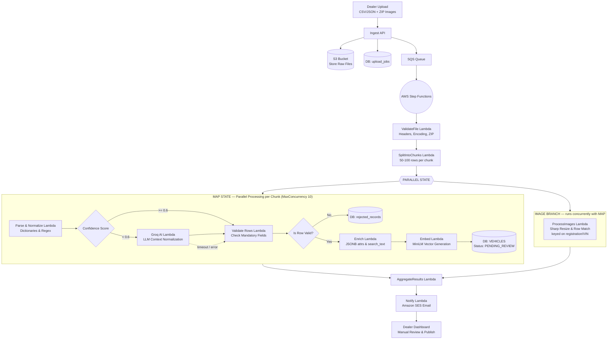

# ETL Pipeline — Design

> **Status:** current design. Implements `Documentation/ETL Pipeline.png`.
> Supersedes the ETL section of any earlier architecture notes describing a single SQS-triggered `etlWorker` Lambda — that design is replaced here by an AWS Step Functions state machine with per-stage Lambdas.
>
> **Companion:** [Intelligent Search — Design](./Intelligent%20Search.png) and `search-design.md`. The two halves share one normalize + embed library; §13 explains why that is non-negotiable.
>
> **Code status:** `ingestion-service/` is scaffold-only at time of writing. §16 maps every Lambda in this document onto the existing directory structure.

---

## 1. The idea in one paragraph

A dealer uploads a spreadsheet of vehicles and a ZIP of photos. Most rows are clean, some are dirty in predictable ways (`deisel`, `95k`, `auto`), and a few are genuinely ambiguous (`Tyoto`, `"around 9 mn"`, a fuel type mentioned only in the description). Each kind needs different machinery. We repair the predictable mess with deterministic rules, escalate only the ambiguous tail to an LLM, and put a human gate in front of anything the machine had to guess at. Rules are free and run on every row; Groq only sees rows the rules could not resolve; the dealer only reviews rows Groq had to touch.

**The governing principle:** *rules resolve, the LLM interprets, the dealer confirms.* No inferred value reaches `LIVE` status without a human seeing it.

This deliberately mirrors the search pipeline — same rules-first structure, same confidence gate, same LLM-as-fallback. It is the same problem (messy human text → structured data) approached from opposite ends.

---

## 2. Pipeline overview



Dotted arrow is the degradation path — see §10. The `Map` and image branches join at `AggregateResults` — see §14 for how the two are reconciled without a shared listing ID.

---

## 3. Stage 0 — Ingest API (synchronous)

Fast and minimal. Everything expensive is deferred to the state machine.

1. **Auth** — verify the dealer's JWT locally against the shared public key. No per-request call to Auth.
2. **Format check only** — is this parseable CSV/JSON, is the ZIP a real archive. No data quality checks yet.
3. **Store raw** → S3, **untouched**.
4. **Create job** → `upload_jobs` row (`status: PENDING`).
5. **Publish** → **one** SQS message: `{ jobId: 88 }`.
6. **Respond** → `202 Accepted` + `{ jobId }`.

**Why store the raw file untouched.** It is the source of truth. When a normalization bug is found next month, the fix is re-running the pipeline from S3 — not emailing 40 dealers asking them to re-upload. It also settles disputes: *"the CSV said `9 mn`"* becomes answerable.

**Why SQS between the API and the state machine.** A durable buffer. `StartExecution` has account-level rate limits; if Step Functions throttles, the message waits instead of the upload failing. It also gives a natural DLQ for uploads that never started.

> **The distinction that matters:** **one SQS message per upload**, not one per chunk. One message → one execution → whole-file steps run once and fan-in is automatic. Fifty messages would mean fifty independent executions and a hand-written completion counter — see §4.

---

## 4. Why Step Functions, and why chunking happens inside it

The `Worker Service` becomes a Step Functions state machine: **one execution per upload**, with a `Map` state fanning out over row chunks.

### The alternative we rejected

Chunking in the Ingest API and putting 50 messages on SQS gives **50 independent executions with no shared memory of each other**:

- `ValidateFile` is a whole-file check. It would run 50 times on the same file, or move into the API's hot path.
- The dealer gets 50 emails, unless you write "am I the last chunk?" logic.
- "Is the whole job done?" needs a hand-written `upload_jobs.chunks_done` counter, incremented by every execution and checked for `== chunks_total`.

That counter is **the exact coordination problem Step Functions exists to remove.** Chunking before the state machine reintroduces it while adding Step Functions' own overhead — 50 execution histories to page through — on top.

### What we do instead

One execution per upload. Whole-file work sits outside the `Map`; per-chunk work sits inside it. **Fan-in is automatic** — the `Map` does not advance to `AggregateResults` until all iterations finish. Nobody writes a counter.

---

## 5. Where chunk data lives

**S3 — and the descriptors are pointers, not row data.**

`SplitIntoChunks` writes one small array and returns its key. The raw CSV is **never copied**; every chunk points at the same original file with a different row range:

```json
[ {"chunkId":1,"s3Key":"s3://raw/job88/vehicles.csv","rowRange":[0,99]},
  {"chunkId":2,"s3Key":"s3://raw/job88/vehicles.csv","rowRange":[100,199]}, ... ]
```

~3 KB for all descriptors, regardless of file size.

### The 256 KB rule — every state passes a key

Step Functions caps state input/output at **256 KB**. The heaviest handoff is **Embed → Load**:

```
384 floats × ~12 chars each  ≈ 4.6 KB per row of vector alone
× 100 rows                   ≈ 460 KB          ← already ~1.8× over the limit
```

So the payload problem is not theoretical and not confined to one link. **Every state writes its output to S3 and returns a key:**

```json
{ "jobId": 88, "chunkId": 3,
  "s3Key": "s3://staging/job88/chunk3-normalized.json",
  "rowCount": 100, "lowConfidenceCount": 8 }
```

A few hundred bytes between states, at any chunk size. This is what makes the per-stage Lambda split viable at all.

### Bucket layout

```
s3://raw/job88/vehicles.csv                 ← original, untouched, permanent
s3://raw/job88/images.zip                   ← original, untouched, permanent
s3://staging/job88/chunks.json              ← the chunk descriptors
s3://staging/job88/chunk3-normalized.json   ← per stage, per chunk
s3://staging/job88/chunk3-validated.json
s3://staging/job88/chunk3-enriched.json
s3://staging/job88/chunk3-embedded.json
```

**Apply a lifecycle rule expiring `s3://staging/` after ~7 days.** Intermediate files are debugging artifacts, not records — long enough to investigate a failed job, short enough not to accumulate. `s3://raw/` is never expired.

### Chunk sizing

The diagram specifies **50–100 rows per chunk**. Use **100**, and **fix rows-per-chunk rather than chunk count**:

```
100 rows/chunk  →  1,000 rows  =  10 chunks
                → 10,000 rows  = 100 chunks
```

Fixing the *count* at 50 would give a 10,000-row upload 200 rows/chunk, pushing every stage's payload up and lengthening each invocation. `MaxConcurrency: 10` caps parallelism regardless, so the RDS connection pool is protected either way.

---

## 6. Stage 1 — ValidateFile and SplitIntoChunks

**`ValidateFile`** runs once, on the whole file: headers present and mappable, encoding readable, row count within limits, ZIP not corrupt. Structural only — no row is inspected. Failure means the upload is unusable, and the execution ends with one clear reason. Better to reject a broken file in 2 seconds than to produce 5,000 rejected rows.

**`SplitIntoChunks`** cuts the rows into descriptors (§5) and returns the key.

**Parse is purely structural.** It splits raw text into fields by header position. It does not fix typos, coerce types, or interpret anything. Every value is still a raw string when it reaches Normalize.

---

## 7. Stage 3a — Parse & Normalize (rules only)

Dictionary lookups, regex, unit conversion. No AI. And — the part that makes everything downstream work — **it scores its own confidence per field.**

### How a field is scored

```js
function normalizeFuel(raw) {
  if (!raw || !raw.trim())   return { value: null, confidence: 0.0, method: 'MISSING' };

  const key = raw.trim().toLowerCase();
  if (FUEL_DICT[key])        return { value: FUEL_DICT[key], confidence: 1.0, method: 'EXACT' };

  const fuzzy = fuzzyMatch(key, Object.keys(FUEL_DICT));
  if (fuzzy.score >= 0.85)   return { value: FUEL_DICT[fuzzy.match], confidence: fuzzy.score, method: 'FUZZY' };

  return { value: null, confidence: fuzzy.score, method: 'UNRESOLVED', raw };
}
```

| How it resolved | Confidence | Example |
|---|---|---|
| Exact dictionary hit | `1.0` | `"Petrol"` is literally a dictionary key |
| Close fuzzy match | `0.85 – 0.99` | `"deisel"` is one transposition from `diesel` |
| Regex pattern hit | `0.90 – 1.0` | `"95k"` matches `/^(\d+)k$/i` → `95000` |
| Weak / ambiguous match | `< 0.85` | `"Tyoto"` — two edits, to two different makes |
| Empty but required | `0.0` | blank field |

**The row's confidence is the minimum across its required fields.** One bad field drags the whole row down — because that is the field that will be wrong in the database. Averaging would let five clean fields hide one corrupt one.

### Three rules that prevent silent corruption

Carried over from the search parser — same failure modes, higher stakes, because an ingest error is stored permanently.

**Type gating.** A token containing a digit is never eligible for make/model fuzzy matching. Without it, `"5 seats"` trigram-matches **SEAT**, the Spanish brand. A wrong parse is worse than no parse, precisely because it looks successful and never trips the confidence gate.

**Correct make first, then constrain model by it.** Match `corrola` only within Toyota's model list, not against every model of every make. Sequence matters.

**Store both.** Keep `make_raw = "Toyata"` alongside `make = "Toyota"`. Auditable, reversible, and it surfaces dealer export bugs — a systematic misspelling across 500 rows is a broken feed, not 500 typos.

### Worked example — one chunk, 4 rows

Raw CSV, exactly as parsed:

```
make,model,year,fuel,mileage,transmission,price,description
Toyota,Corolla,2018,Petrol,45000,Automatic,8500000,Well maintained
Toyata,Corrola,2018,deisel,95k,auto,8.5m,full option AC
Tyoto,Corola Axio,2018,,"about 60 thousand km",,"around 9 mn","1.5L turbo petrol hybrid, full option"
Honda,Civic,2019,Petrol,32000,Manual,11000000,Single owner
```

---

**Row 1 — `Toyota,Corolla,2018,Petrol,45000,Automatic,8500000`**

```
make          "Toyota"     → Toyota      EXACT  1.00
model         "Corolla"    → Corolla     EXACT  1.00
year          "2018"       → 2018        EXACT  1.00
fuel          "Petrol"     → PETROL      EXACT  1.00
mileage       "45000"      → 45000       EXACT  1.00
transmission  "Automatic"  → AUTOMATIC   EXACT  1.00
price         "8500000"    → 8500000     EXACT  1.00
                                  row confidence = 1.00
```

Clean. Nothing to decide.

---

**Row 2 — `Toyata,Corrola,2018,deisel,95k,auto,8.5m`**

```
make          "Toyata"   → Toyota      FUZZY  0.92   (1 transposition)
model         "Corrola"  → Corolla     FUZZY  0.93   (1 deletion, within Toyota's models)
year          "2018"     → 2018        EXACT  1.00
fuel          "deisel"   → DIESEL      FUZZY  0.91   (1 transposition)
mileage       "95k"      → 95000       REGEX  1.00   (/^(\d+)k$/i)
transmission  "auto"     → AUTOMATIC   EXACT  1.00   (alias in dictionary)
price         "8.5m"     → 8500000     REGEX  0.95   (/^([\d.]+)m$/i)
                                  row confidence = 0.91
```

**This is the load-bearing example.** The row looks filthy — four of seven fields wrong or abbreviated — and rules fix every one without an LLM call. Each typo is one edit from a dictionary entry; each abbreviation matches a known pattern.

> **AI is not for dirty data. AI is for ambiguous data.** Most "messy" dealer CSVs are messy in enumerable, predictable ways. Sending row 2 to Groq would be paying for something a hash lookup already solved.

---

**Row 3 — `Tyoto,Corola Axio,2018,,"about 60 thousand km",,"around 9 mn","1.5L turbo petrol hybrid, full option"`**

```
make          "Tyoto"                → ?     FUZZY       0.71  ← Toyota(2 edits) vs Tata(2 edits)
model         "Corola Axio"          → ?     FUZZY       0.78  ← is "Axio" a trim or the model?
year          "2018"                 → 2018  EXACT       1.00
fuel          ""                     → null  MISSING     0.00  ← blank, but description says "petrol hybrid"
mileage       "about 60 thousand km" → ?     UNRESOLVED  0.00  ← prose; no regex anchor
transmission  ""                     → null  MISSING     0.00
price         "around 9 mn"          → ?     UNRESOLVED  0.30  ← "mn" not in the unit dictionary
                                  row confidence = 0.00
```

**This is the row Groq exists for** — and note precisely *why*:

- `"Tyoto"` is **equidistant** between two real makes. A fuzzy matcher picking one is guessing, not matching.
- `mileage` and `price` are **natural-language prose**. Regex has nothing to anchor to.
- `fuel` is blank in its own column but **stated in the description**. Rules never look across fields.

Each is a *structural* limitation of rules, not a gap in the dictionary. Adding aliases would fix none of them.

---

**Row 4 — `Honda,Civic,2019,Petrol,32000,Manual,11000000`** → `1.00`. Clean.

### Output

```json
{ "jobId": 88, "chunkId": 3,
  "s3Key": "s3://staging/job88/chunk3-normalized.json",
  "rowCount": 4, "lowConfidenceCount": 1, "lowConfidenceRowIds": [3] }
```

Rows live in S3. Only counters travel between states.

---

## 8. Stage 3b — Confidence Score (a `Choice` state)

The diamond in the diagram, and the cleanest possible fit with Step Functions. It invokes **no Lambda**, costs nothing, and renders as an actual branching diamond in the console.

```json
"ConfidenceChoice": {
  "Type": "Choice",
  "Choices": [
    { "Variable": "$.lowConfidenceCount", "NumericGreaterThan": 0, "Next": "GroqNormalize" }
  ],
  "Default": "ValidateRows"
}
```

Threshold **0.6**, per the diagram. Our chunk: `lowConfidenceCount = 1` → **Groq**.

### Where the cost saving actually lives

At 100 rows/chunk, most chunks contain *at least one* low-confidence row, so the chunk-level branch fires often. That is fine — **the saving is inside the Groq Lambda, which filters to flagged rows before building any prompt.**

```
Chunk of 100 rows, 8 flagged:
  ✗ 100 Groq calls        (per-row, no filtering)
  ✗ 1 call with 100 rows  (branch taken, no filtering — pays for 92 clean rows)
  ✓ 1 call with 8 rows    ← what we do
```

Rows 1, 2 and 4 never enter a prompt.

> **On the 0.6 threshold.** Search uses 0.6 because a bad result costs one poor page. Ingest writes are permanent and poison every future query against that listing, which argues for a stricter gate. Two defensible positions: keep 0.6 and rely on the `PENDING_REVIEW` human gate (§14) to catch errors — the diagram's choice, and coherent because the gate exists — or raise the *rejection* bar separately by routing the 0.6–0.85 band to the review queue flagged. Either way, log every score to `etl_stage_logs` from day one and tune on real dealer files.

---

## 9. Stage 3c — Groq AI Lambda (flagged rows only)

Reads the S3 file, filters to flagged rows, sends **those only**.

### The prompt

Constrained, and given the dictionary so the model picks from *our* vocabulary rather than inventing values:

```
You are normalizing second-hand vehicle listing data for Sri Lanka.

Allowed makes: Toyota, Honda, Nissan, Suzuki, Mitsubishi, Tata, Mazda, BMW, ...
Allowed fuel: PETROL, DIESEL, HYBRID, ELECTRIC
Allowed transmission: AUTOMATIC, MANUAL, CVT

Rules:
- Prices are in LKR. "mn" / "mil" / "m" = million.
- Mileage in km. Convert prose to an integer.
- You MAY infer a field from the description if clearly stated there.
- If genuinely ambiguous, return null and explain. DO NOT GUESS.
- Return ONLY valid JSON.

Row:
{"make":"Tyoto","model":"Corola Axio","year":"2018","fuel":"",
 "mileage":"about 60 thousand km","transmission":"",
 "price":"around 9 mn",
 "description":"1.5L turbo petrol hybrid, full option"}

Return: {"make":…, "model":…, "fuel":…, "mileage":…,
         "transmission":…, "price":…, "confidence":0-1, "reasoning":"…"}
```

**Shortlist large enums.** Makes (~200) and models (~thousands) must not be dumped in full — thousands of wasted tokens per call. Trigram-match the unresolved token against the makes table and send the **top ~10 candidates**. The enum is not there to teach the model what cars exist; it knows that from pretraining. It is there to force output into strings that will match a database value.

### Groq's response for row 3

```json
{
  "make": "Toyota", "model": "Corolla Axio", "fuel": "HYBRID",
  "mileage": 60000, "transmission": null, "price": 9000000,
  "confidence": 0.88,
  "reasoning": "'Tyoto' + 'Corola Axio' → Toyota Corolla Axio, a common Sri Lankan import; the Axio trim disambiguates the make. Description states 'petrol hybrid' → HYBRID. 'about 60 thousand km' → 60000. 'around 9 mn' → 9,000,000 LKR. Transmission absent from both the column and the description — not inferred."
}
```

What it did that rules **structurally cannot**:

| Capability | Evidence in this row |
|---|---|
| **Cross-field reasoning** | Used `"Axio"` — a trim name — to resolve the ambiguous make `"Tyoto"` |
| **Reading a different column** | Pulled `fuel: HYBRID` from the free-text description |
| **Prose → number** | `"about 60 thousand km"` → `60000`; `"around 9 mn"` → `9000000` |
| **Refusing to guess** | Left `transmission: null` and said why |

That last row is the most valuable behavior in the table. `transmission` now reaches Validate as *genuinely absent* — and if it were mandatory, the row would land in `rejected_records` with an actionable reason rather than carrying a fabricated `AUTOMATIC` into the database forever.

### Validation and merge — the LLM proposes, the validator disposes

Every returned field is whitelist-checked before it is trusted. **Rules win on conflict** — they are deterministic and auditable.

- Closed enums (`fuel`, `transmission`, `body_type`) must be a listed string, or the field is dropped.
- `make` / `model` are **proposals**, resolved against an **in-memory copy of the makes/models table** loaded at container init (same mechanism as the dictionaries in §7) — dropped if unmatched. This is a lookup, not a live query; `groqNormalizeFn` does not hold a database connection. See §14 for why that distinction matters for `MaxConcurrency`.
- Open numerics (`price`, `mileage`, `year`) are type- and range-checked — `year: 1776` is rejected regardless of who produced it.

*The prompt makes bad output unlikely; the validator makes it harmless.*

### Provenance — tag every AI-touched field

```json
{
  "make":         { "value": "Toyota",       "source": "GROQ",  "confidence": 0.88 },
  "model":        { "value": "Corolla Axio", "source": "GROQ",  "confidence": 0.88 },
  "year":         { "value": 2018,           "source": "RULES", "confidence": 1.00 },
  "fuel":         { "value": "HYBRID",       "source": "GROQ",  "confidence": 0.88 },
  "mileage":      { "value": 60000,          "source": "GROQ",  "confidence": 0.88 },
  "transmission": { "value": null,           "source": "GROQ",  "confidence": 0.00 },
  "price":        { "value": 9000000,        "source": "GROQ",  "confidence": 0.88 }
}
```

Carry `source` through to review. It turns the dealer dashboard from *"re-read all 1,000 rows"* into *"confirm these 47 inferred fields"* — the difference between a gate dealers use and one they click past.

`source` also feeds the **alias loop**: corrections logged frequently enough get promoted into the lookup dictionaries. Next upload they resolve in the rules path at zero cost. **The parser gets cheaper the more it is used.**

---

## 10. Degradation paths

Groq is an external network call: it can time out, rate-limit, return malformed JSON, or be down. **An upload must never fail wholesale because an LLM was unavailable.**

```json
"GroqNormalize": {
  "Type": "Task",
  "Resource": "arn:aws:lambda:...:function:groqNormalizeFn",
  "Retry": [
    { "ErrorEquals": ["RateLimitError"], "IntervalSeconds": 2, "MaxAttempts": 5, "BackoffRate": 2.0 },
    { "ErrorEquals": ["States.Timeout"], "IntervalSeconds": 5, "MaxAttempts": 2 }
  ],
  "Catch": [
    { "ErrorEquals": ["States.ALL"], "Next": "ValidateRows", "ResultPath": "$.groqError" }
  ],
  "Next": "ValidateRows"
}
```

Read the `Catch` carefully: if Groq is down entirely, the chunk **does not fail**. It falls through to Validate carrying rules-only data. Rows 1, 2 and 4 still import perfectly; row 3 is rejected with a reason. **A Groq outage degrades a 1,000-row upload to ~95% success instead of 0%.**

| Failure | Behavior |
|---|---|
| Groq rate-limited | Retry 5×, exponential backoff from 2 s |
| Groq timeout / down | `Catch` → proceed with rules-only data |
| Malformed JSON | Same — treated as failure, rules-only |
| One field fails validation | Drop that field, keep the rest |
| All fields rejected | Row proceeds with rules-only values |
| Row still incomplete | → `rejected_records` with a reason |

**None of this retry logic is hand-written.** It is declared in the state machine — the strongest single argument for Groq being its own state rather than a `try/catch` inside a larger Lambda.

---

## 11. Stage 3d — Validate Rows

Per-row business validation, **after** normalization has had both attempts.

> **Order matters and is easy to get backwards.** Validating *before* normalizing would reject row 2 outright — `mileage: "95k"` is not a number, `price: "8.5m"` is not a number — when regex turns both into valid integers a moment later. Row 3 would be rejected for a blank `fuel` that Groq reads out of the description. **Validation must run on normalized values, because normalization is what makes them valid.** Its real question is *"after both repair attempts, is this row still unusable?"*

### Three field tiers — only one can reject

**Tier 1 — Required.** Keep brutally short: `make`, `model`, `year`, `price`, `mileage`. A listing cannot exist without these.

**Tier 2 — Derived at ingestion.** `body_type`, `age`, `slug`, `search_text`, `embedding`. **Never rejected** — computed in §12.

**Tier 3 — Optional / unknown columns.** Unrecognized columns go into JSONB `attributes` and are appended to `search_text`. `"full option"`, `"full AC"`, `"sunroof"` are *useful* — they feed semantic search. **Never a rejection reason.**

> **Design rule:** *reject only what cannot be computed, inferred, or defaulted.*

The one case that must still reject: a **required** field present but genuinely ambiguous — `price: "call me"`, `year: 1776`, two conflicting year values. Guessing corrupts data permanently.

### Our four rows at this gate

| Row | Outcome |
|---|---|
| 1 | All Tier 1 present and valid → **pass** |
| 2 | All Tier 1 present after fuzzy correction → **pass** |
| 3 | Tier 1 complete (Groq resolved make/model/year/price/mileage). `transmission` is Tier 3 → **pass**, flagged for review |
| 4 | All Tier 1 present and valid → **pass** |

Because `transmission` is not Tier 1, Groq's refusal to guess costs nothing. Had it been mandatory, the row would go to `rejected_records` with `"transmission missing; not stated in any column"` — actionable, unlike a silent wrong value.

**Rejection does not stop the chunk.** Rejected rows go to `rejected_records` with a reason; the rest proceed.

---

## 12. Stage 3e — Enrich Lambda

Derives **new fields from clean ones**. One hard rule: **nothing here can ever reject a row.** Every field has a fallback. Normalization and Groq have already done the repair work — Enrich is pure computation over trusted values.

### 12.1 Simple derivations

```js
age  = CURRENT_YEAR - year;                          // 2026 - 2018 = 8
slug = slugify(`${year}-${make}-${model}-${id}`);    // "2018-toyota-corolla-axio-1042"

price_band   = price < 3_000_000  ? "BUDGET"
             : price < 8_000_000  ? "MID"
             : price < 20_000_000 ? "PREMIUM" : "LUXURY";

mileage_band = mileage < 30_000  ? "LOW"
             : mileage < 100_000 ? "MODERATE" : "HIGH";
```

Bands matter because buyers type *"cheap"* and *"low mileage"*, not *"under 3 million"*. Putting the band **word** into `search_text` gives the embedding something to latch onto.

### 12.2 Lookup with a fallback chain

```js
body_type = BODY_TYPE_MAP[`${make}|${model}`]        // "Toyota|Corolla Axio" → SEDAN
         ?? inferFromSeatsAndName(seats, model)      // 7 seats + "Noah"      → VAN
         ?? "UNKNOWN";
```

**`UNKNOWN` is a valid stored value, not a failure.** If body type cannot be classified we store `UNKNOWN` and fold the raw model name into `search_text` — so a buyer searching *"SUV"* still reaches the listing semantically through the vector, even though the column says nothing useful. Rejecting instead would lose a good listing over a field the dealer never provided.

### 12.3 Per-vehicle-type attributes (JSONB)

Two jobs at once.

**Job A — type-specific fields.** Different vehicle types have genuinely different specs:

```js
switch (vehicle_type) {
  case 'CAR':   attributes = { gearbox, body_type, seats, doors, drive_type, engine_cc }; break;
  case 'BIKE':  attributes = { engine_cc, bike_type, has_electric_start, stroke };        break;
  case 'VAN':   attributes = { seats, payload_kg, roof_height, sliding_doors };           break;
  case 'TRUCK': attributes = { payload_kg, axles, body_style, gvw };                      break;
}
```

Why JSONB and not real columns: a bike has no `payload_kg`, a truck has no `bike_type`. Real columns would mean dozens of perpetually-NULL fields and a migration for every new vehicle type. JSONB means **new vehicle types need no schema change**, and search stays one query over one table.

**Job B — unknown columns preserved.**

```js
attributes.extras = unmappedColumns;
// { "sunroof": "yes", "full option": "true", "service records": "complete" }
```

Never a rejection reason. They are an asset — see below.

### 12.4 Building `search_text`

The most important output of the stage, and why Enrich must run before Embed.

```js
search_text = [
  year, make, model, body_type, fuel, transmission,
  `${mileage} km`, `${price} LKR`,
  price_band, mileage_band,                     // "MID", "MODERATE"
  ...Object.values(attributes).filter(isText),  // per-type fields
  ...Object.keys(attributes.extras),            // "sunroof", "full option"
  description                                   // the dealer's raw prose
].filter(Boolean).join(' ');
```

Our rows:

```
Row 2 → "2018 Toyota Corolla SEDAN DIESEL AUTOMATIC 95000 km 8500000 LKR
         MID MODERATE full option AC"

Row 3 → "2018 Toyota Corolla Axio SEDAN HYBRID 60000 km 9000000 LKR
         PREMIUM MODERATE 1.5L turbo petrol hybrid, full option"
```

**Row 3's description is the payoff.** The exact prose that made it unparseable in §7 — `"1.5L turbo petrol hybrid, full option"` — becomes an asset here. Those are precisely the phrases a buyer types. The messiness that was a liability during normalization is signal during retrieval.

### 12.5 Output

```json
{
  "id": 1042, "make": "Toyota", "model": "Corolla Axio", "year": 2018,
  "fuel": "HYBRID", "mileage": 60000, "price": 9000000, "vehicle_type": "CAR",
  "age": 8, "slug": "2018-toyota-corolla-axio-1042",
  "body_type": "SEDAN", "price_band": "PREMIUM", "mileage_band": "MODERATE",
  "attributes": { "gearbox": null, "body_type": "SEDAN", "seats": 5,
                  "extras": { "full option": "true" } },
  "search_text": "2018 Toyota Corolla Axio SEDAN HYBRID 60000 km 9000000 LKR PREMIUM MODERATE 1.5L turbo petrol hybrid, full option"
}
```

No `embedding` yet — that is the next stage. And **no possible rejection**: every field computed, defaulted, or `UNKNOWN`.

---

## 13. Stage 3f — Embed Lambda

`search_text` → MiniLM (`all-MiniLM-L6-v2`) → **384-dim vector**, stored on the listing.

> **Embed `search_text` only — never the whole row object.** Embedding raw JSON drags brace characters, column names and ID numbers into the vector as structural noise that means nothing semantically. `search_text` exists precisely to be the one clean natural-language string that gets embedded. This mirrors the query side, where only leftover descriptive words are embedded, never the filter tokens.

### The model-parity constraint

**The model that embeds listings here and the model that embeds queries at search must be byte-identical** — same model, same version, same pooling, same normalization. Different models produce vectors in incompatible coordinate spaces and yield **confident nonsense** rather than an error. Nothing throws. Results are just quietly wrong.

Consequence: **upgrading the model requires re-embedding every listing.** There is no partial migration. This is why normalize + embed live in a **shared library** used by both ingestion and search.

### One shared vocabulary

The same argument applies to dictionaries. If ingest stores `MERCEDES-BENZ` but the search enum offers `Mercedes`, then `WHERE make = 'Mercedes'` matches nothing — **silently**. No error, zero results. Same if ingest derives `MPV` while search offers `VAN`.

**Ingest-side and search-side normalization must use the same dictionaries and the same canonical values.** One shared library, or the two halves quietly stop agreeing.

### Why this is its own Lambda

MiniLM is ~90 MB and needs ~3 GB of memory — 12× what the Groq Lambda needs. Load the model at **module scope** so warm containers reuse it across invocations.

---

## 14. Stages 3g–6 — Load, Images, Aggregate, Notify, Review

**Load** writes accepted rows to `vehicles` with **`status: PENDING_REVIEW`**, rejected rows to `rejected_records` with reasons, and updates `upload_jobs` counters. It is the only stage that opens a **write** connection to the database — which is what `MaxConcurrency: 10` is really protecting.

`groqNormalizeFn`'s make/model resolution (§9) touches no live connection: it matches against an in-memory table snapshot loaded once at container init, refreshed periodically (e.g. every few minutes, or on cold start) rather than per invocation. This keeps the pool-sizing argument intact — at `MaxConcurrency: 10`, only `loadFn` ever contends for a connection, and only 10 can be open at once.

**ProcessImages** matches rows to photos in the ZIP, resizes and compresses with **Sharp** (thumbnail + full), stores in S3, attaches URLs.

It runs as a **`Parallel` branch alongside the `Map`**, not sequentially after it. Images come from the ZIP and depend on nothing in the text pipeline — a listing's photos don't need to wait for its fuel type to be normalized. Running the two concurrently cuts wall-clock time on a large upload instead of paying for image processing on top of the Map's duration.

The cost of this is that **listing IDs do not exist yet** when `ProcessImages` runs, since `LoadChunk` is still inserting rows in the other branch. Matching cannot join on a database ID — it must key on a **business identifier already present in the CSV**, typically the registration number or VIN:

```
imagesFn  → writes to listing_images keyed by registration_number
loadFn    → writes to vehicles, registration_number is a real column
```

A post-`Parallel` step (or a `UNIQUE` constraint + upsert in `AggregateResults`) joins the two on that key once both branches finish. This is a firm requirement of running the branches concurrently, not an optional refinement — without it, images and rows have no way to find each other.

**AggregateResults** tallies accepted / rejected / flagged across all chunks — once, automatically, because the `Map` has already waited for every iteration.

**Notify** sends **one** SES email: *"47 imported, 2 rejected, 5 need your review."* Once per upload, because there is one execution per upload.

### The Dealer Dashboard sits outside the state machine

The diagram's final box is Manual Review & Publish. **Do not model this as Step Functions states.** A human might take three days. The objection is not the one-year execution limit — it is that an execution parked on human latency is one you cannot reason about or reason with.

```
Load writes rows as PENDING_REVIEW
    ↓
Execution ENDS. The job is complete from the pipeline's perspective.
    ↓
Dealer reviews at leisure via the marketplace service
    ↓  approve  →  status = LIVE
    ↓  edit     →  re-run shared normalize + embed on that row  →  status = LIVE
```

**Any edit that changes searchable text must re-run the shared normalize + embed library** — otherwise the stored vector describes the old text and the listing becomes unfindable for the words it now contains.

The review UI should sort by `source: GROQ` and confidence band, surfacing lowest-confidence rows first. In our example the dealer sees rows 1, 2 and 4 as clean, and row 3 with five fields marked *AI-inferred* alongside Groq's `reasoning` string.

> If the human gate genuinely must live inside the state machine, the tool is a `.waitForTaskToken` task. It adds real complexity for little gain here.

---

## 15. Concurrency model — what actually runs in parallel

Three distinct kinds, easily conflated.

### The Map fan-out (the main one)

`MaxConcurrency: 10` → **10 chunks process simultaneously**, each independently walking the stage chain.

```
t=0    chunk1 [parseNorm]  chunk2 [parseNorm]  ... chunk10 [parseNorm]
t=2s   chunk1 [groq     ]  chunk2 [validate ]  ... chunk10 [groq     ]   ← different stages
t=4s   chunk1 [validate ]  chunk2 [enrich   ]  ... chunk10 [validate ]
t=7s   chunk1 [embed    ]  chunk2 [embed    ]  ... chunk10 [enrich   ]
```

**Chunks drift out of step** — chunk 2 skipped Groq, so it runs a stage ahead. Expected; iterations are fully independent.

**Within one chunk, stages are strictly sequential.** Enrich cannot start before Normalize finishes — a data dependency, not a scheduling choice.

A 1,000-row upload at 10 chunks runs in roughly the time of **one chunk's chain**, not ten.

### What is *not* parallel

| Thing | Parallel? |
|---|---|
| 10 chunks | ✅ `MaxConcurrency: 10` |
| Stages within one chunk | ❌ hard data dependency |
| Rows within one chunk | ❌ a loop inside one Lambda |
| ValidateFile, Split, Aggregate, Notify | ❌ once per upload, sequential |
| Map vs Images | ✅ yes — `Parallel` branch, joined on registration/VIN, see §14 |

Rows being sequential inside a chunk is fine: 100 dictionary lookups is microseconds. The parallelism that matters is at the chunk level.

### Why not fuse the Map into one Lambda?

A single `processChunkFn` doing normalize→groq→validate→enrich→embed→load in memory is a real alternative, and it wins on several axes:

| | Split (this design) | Fused (one Lambda) |
|---|---|---|
| Invocations / 1,000 rows | ~61 | 10 |
| Cold starts per chunk | up to 8 | 1 |
| Memory billed | 256 MB – 3 GB per stage | **3 GB for everything** |
| S3 staging round-trips | ~16 per chunk | 0 |
| Retry granularity | per stage | whole chunk |
| Groq outage handling | declarative `Catch` | hand-written |
| Console visibility | per-stage, live | one box + logs |
| Dictionaries loaded | 3× (separate containers) | 1× |

Fused is genuinely cheaper and simpler, and the honest position is that it is **not wrong**. We stay split for two reasons that are not aesthetic:

1. **The memory spread is real.** Fused, the function must be 3008 MB for MiniLM — so dictionary lookups and, worse, *waiting on Groq's network call* are billed at 3 GB. Groq is the slowest stage and does nothing but wait.
2. **The Groq `Catch` pays for the whole design.** Four lines of declaration turn an outage from "the upload fails" into "95% imports, ambiguous rows rejected with reasons." Hand-writing that — with backoff, partial-failure tracking, and ensuring one Groq exception does not kill 100 good rows — is code to write, test and maintain.

**Middle option, held in reserve:** if cold starts hurt in testing, fuse **only Enrich + Embed**. Enrich's sole consumer is Embed, and that handoff is where payload balloons from ~1 KB/row of text to ~4.6 KB/row of vector. Fusing exactly those two removes the heaviest S3 round-trip and one 3 GB cold start while keeping Groq's retry policy and Validate's rejection stage separate — the two splits actually earning their keep. Cost: one box on the diagram. **Measure first.**

---

## 16. The Lambda inventory — 11 functions

**8 in the row chain, 3 outside it.** The Confidence Score diamond is *not* a Lambda — it is a `Choice` state: zero invocations, zero cost, still a diamond on the console graph.

| # | Lambda | Memory | Runs | Job |
|---|---|---|---|---|
| 1 | `validateFileFn` | 256 MB | once/upload | Headers, encoding, row count, ZIP integrity |
| 2 | `splitChunksFn` | 512 MB | once/upload | Rows → chunk descriptors → S3 |
| 3 | `parseNormalizeFn` | 512 MB | per chunk | Parse + dictionaries + regex + confidence score |
| 4 | `groqNormalizeFn` | 256 MB | per flagged chunk | LLM repair — **own retry + `Catch`** |
| 5 | `validateRowsFn` | 256 MB | per chunk | Mandatory fields → `rejected_records` |
| 6 | `enrichFn` | 512 MB | per chunk | §12 — derivations, JSONB, `search_text` |
| 7 | `embedFn` | **3008 MB** | per chunk | MiniLM → 384-dim vector |
| 8 | `loadFn` | 512 MB | per chunk | Bulk insert → `vehicles` as `PENDING_REVIEW` |
| 9 | `imagesFn` | **2048 MB** | once/upload | Sharp resize + row↔photo matching |
| 10 | `aggregateFn` | 256 MB | once/upload | Tally accepted / rejected / flagged |
| 11 | `notifyFn` | 256 MB | once/upload | One SES email |

### Why Parse and Normalize are one Lambda

The diagram already draws them as one box, and that is correct. Parse is *purely structural* — split text into fields by header position. It produces no decision, no distinct failure mode, no different resource need, and its output is only ever consumed by Normalize, immediately. Splitting them would cost an invocation, a cold start, and an S3 round-trip between two 512 MB functions running back-to-back.

### The memory spread is the argument

`embedFn` at 3008 MB versus `groqNormalizeFn` at 256 MB — **12×**. Lambda bills GB-seconds, and a fused function must be sized for its heaviest stage. `groqNormalizeFn` spends most of its life *waiting on a network call*; paying 3 GB to wait is the concrete waste. This is the most defensible single answer to "why did you split these?"

### Invocation count — 1,000-row upload, 100 rows/chunk

```
 1  validateFile        1  splitChunks
10  parseNormalize     ~6  groqNormalize   (only chunks with flagged rows)
10  validateRows       10  enrich
10  embed              10  load
 1  images              1  aggregate         1  notify
────
~61 invocations · 1 execution · ~66 state transitions
```

At 20 rows/chunk this becomes ~250 invocations for identical work. **Chunk size drives cost far more than Lambda count does.**

### Mapping onto the existing scaffold

`ingestion-service/` already has the pipeline stages as directories. The state machine maps onto them almost one-to-one:

```
src/workers/etl-worker/pipeline/
├── normalize/          → parseNormalizeFn  (+ groqNormalizeFn)
├── validate/           → validateFileFn, validateRowsFn
├── enrich/             → enrichFn
├── embeddings/         → embedFn
├── image-processing/   → imagesFn
└── persistence/        → loadFn
```

Two structural notes. The scaffold's `src/lambda/` has three entrypoints (`ingest-api`, `job-status-api`, `etl-worker`) reflecting the earlier SQS-worker design — the ETL stages now need **one entrypoint per state**, since Step Functions invokes each Lambda separately. And `etl-worker.Dockerfile` currently anticipates carrying every heavy dependency at once; splitting it into **at least two images** — a MiniLM image for `embedFn` and a Sharp image for `imagesFn` — is what lets the light stages stay at 256 MB with fast cold starts.

---

## 17. The whole chunk, end to end

| Row | Rules confidence | Groq? | Validate | Final |
|---|---|---|---|---|
| 1 · Toyota Corolla | `1.00` | no | pass | `PENDING_REVIEW` → approved → **LIVE** |
| 2 · Toyata/deisel/95k | `0.91` | no | pass | `PENDING_REVIEW` → **LIVE** (rules fixed everything) |
| 3 · Tyoto/prose | `0.00` | **yes** | pass | `PENDING_REVIEW`, **5 fields flagged AI-inferred** |
| 4 · Honda Civic | `1.00` | no | pass | `PENDING_REVIEW` → **LIVE** |

**1 Groq call for 4 rows.** At scale: a 100-row chunk with 8 flagged rows makes **one** call containing 8 rows — not 100 calls, not one call with 100 rows.

### What this demonstrates

1. **Rules earn their place.** Row 2 looks filthy and costs nothing. Dirty ≠ ambiguous.
2. **The confidence gate routes correctly.** One row of four took the expensive path. The LLM sits on the tail, not the hot path.
3. **Refusing to guess is a feature.** `transmission: null` with a stated reason beats a fabricated `AUTOMATIC` nobody notices.
4. **Provenance makes the human gate usable.** The dealer reviews 5 flagged fields, not 4 rows × 7 fields.

---

## 18. Design decisions worth defending

| Decision | Reason |
|---|---|
| Step Functions over a single SQS worker | Declarative retries, per-stage memory sizing, live execution graph — none hand-written |
| SQS between API and state machine | Durable buffer against `StartExecution` throttling; natural DLQ |
| **One** SQS message per upload, not per chunk | One execution → whole-file steps run once, fan-in automatic |
| `Map` inside the state machine | No hand-written `chunks_done` counter |
| States pass S3 keys, not rows | 100 rows × 384 floats ≈ 460 KB vs a 256 KB state limit |
| Fix rows-per-chunk, not chunk count | Fixing the count breaks at 10,000 rows |
| Confidence check as a `Choice` state | Zero cost, zero invocations, still renders as the diamond |
| Filter to flagged rows *inside* the Groq Lambda | The branch fires often; the saving is in the payload |
| Rules first, LLM second | Rules are free, deterministic, auditable. Most rows never need the LLM |
| LLM as interpreter, not parser | Bounded blast radius; `Catch` degrades instead of failing |
| Whitelist validation on return | The prompt makes bad output unlikely; the validator makes it harmless |
| `source: GROQ` provenance tags | Turns dealer review from re-reading everything into confirming inferences |
| Validate **after** normalize + Groq | Validating first rejects rows normalization would have fixed |
| Embed `search_text`, not the row object | Raw JSON pollutes the vector with structural noise |
| Store `make_raw` alongside `make` | Auditable, reversible, surfaces broken dealer feeds |
| `PENDING_REVIEW`, not `LIVE` | Nothing the machine guessed at goes public unseen |
| Human gate outside the state machine | Executions must not park on human latency |
| Images as their own Lambda | Different tool (Sharp), different data (bytes), genuine independence |
| `UNKNOWN` over rejection | Reject only what cannot be computed, inferred, or defaulted |
| JSONB `attributes` per vehicle type | New vehicle types need no schema change; search stays one query |
| Shared normalize + embed library | Vocabulary drift and model drift both fail *silently* |

---

## 19. Open items

1. **Confidence threshold** — the diagram sets 0.6. Log every field's score to `etl_stage_logs` from day one and tune against real dealer files; see the note in §8 on ingest-vs-search asymmetry.
2. **Chunk size** — 100 rows within the diagram's 50–100 band. Tune against Lambda duration and Groq payload size once real files are measured.
3. **`MaxConcurrency`** — 10 is bounded by the RDS connection pool, not by Lambda. Confirm the pool can take 10 concurrent `loadFn` invocations, or introduce RDS Proxy.
4. **Groq determinism** — set `temperature: 0` and cache by row-hash so an identical row normalizes identically on re-runs. Re-processing from S3 must be reproducible.
5. **Staging lifecycle** — confirm the ~7-day expiry on `s3://staging/`. Eight stages × 10 chunks ≈ 80 objects per upload.
6. **Review-queue ownership** — who resolves low-confidence rows: the dealer, or an internal admin?
7. **Alias promotion policy** — how many logged occurrences before a correction is promoted into the dictionary, and who approves it.
8. **Re-processing semantics** — re-running a job from the raw S3 file: update existing listings in place, or create new ones? Determines whether `loadFn` upserts.
9. **Image branch join** — confirm registration number / VIN is reliably present and unique enough across dealer CSVs to key the `Parallel`-branch join; define the fallback when it's missing.
10. **Dockerfile split** — `etl-worker.Dockerfile` should become at least two images (MiniLM, Sharp) so light stages keep fast cold starts.
