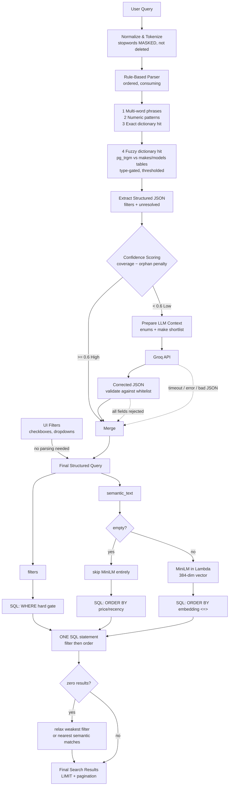

# Intelligent Search — Design

> **Status:** current design. Supersedes `Intelligent Search.png` and any earlier search notes.

---

## 1. The idea in one paragraph

A buyer types a sentence, not a form. *"I need a comfortabble sporting carr with 4 seats"* contains three different kinds of information: a **hard constraint** (4 seats), **misspellings** (comfortabble, carr), and **vibes** (sporting, comfortable). Each needs different machinery. We extract hard constraints with deterministic rules, repair the messy tail with an LLM, and handle vibes with vector similarity. The rules are free and run on every query; the LLM only sees queries the rules could not handle; the vector search only runs when descriptive words are left over.

**Two governing principles:**

1. *The LLM proposes, the database disposes.* No model output reaches SQL without passing a whitelist validator.
2. *Fuzzy matching resolves vocabulary; it never ranks results.* Trigram matching runs against dictionary tables during parsing, never against `listings` at query time. See §11 for the full argument.

---

## 2. Pipeline overview



Dotted arrows are degradation paths (§8). Note that filters **gate** and only the vector **orders** — they are not peers.

---

## 3. Stage 1 — Normalize & Tokenize

Lowercase, strip punctuation, split on whitespace, **mask** stopwords.

### Stopwords

A short, hand-written, domain-specific list:

```
i, me, my, we, a, an, the, is, are, was, need, want, looking, for,
find, show, get, buy, with, that, has, have, some, any, please, hi
```

**Never use an off-the-shelf English stopword list.** Standard lists include `under`, `below`, `over`, `between`, `above`, `not` — all load-bearing comparators. Removing `under` from *"under 20 million"* destroys the price filter.

### Mask, don't delete

Stopwords are **flagged, not removed**. Keep one token array with per-token state:

```js
const raw = "i need a family friendli vehicle with 5 seattts";
const tokens = tokenize(raw);   // keep index positions

// Each token carries flags; nothing is deleted.
//   { text, start, end, isStopword, isConsumed }
//
// Parser skips isStopword tokens and marks isConsumed on match.
// semantic_text = original string minus consumed spans.
```

**Why this matters.** If stopwords are stripped outright, MiniLM receives `"family friendli vehicle"` instead of `"a family friendly vehicle"`. The pooled-vector difference is small — determiners contribute little under mean pooling — but there is a subtler problem: **asymmetry with ingest.** Listings are embedded from `search_text` built out of dealer prose, i.e. full natural sentences. Embedding queries from stripped token bags compares two systematically different text distributions in one vector space. Not incompatible spaces (see the model-parity rule in §7), but a consistent distributional offset.

Masking preserves the original benefit of stopword removal — junk tokens do not inflate `unresolved` and drag down the confidence score — while keeping natural-language text available for embedding. The two goals were never in tension; conflating *"don't count it"* with *"delete it"* was the bug.

**One array, no span re-alignment.** An alternative is to strip aggressively and later map unresolved tokens back to spans in the raw query. That is fiddly (offsets must survive normalization, and non-contiguous unresolved tokens make stopword attribution ambiguous) and it is wasted work on the low-confidence path, where Groq *rewrites* the leftover text anyway (§6). Masking costs nothing on either branch.

---

## 4. Stage 2 — Rule-Based Parser

Two extractor families, run in a **strict order**, each token **consumed on match**.

| Extractor | Handles | Why this mechanism |
|---|---|---|
| **Lookup tables** | makes, models, fuel, transmission, body type | Closed vocabularies — every valid value is enumerable |
| **Pattern matching** | price, mileage, year, seats, comparators | Open-ended numerics — cannot be enumerated, must be parsed |

### Resolution order (most specific first)

```
1. Multi-word phrases   ("4 seats", "land cruiser", "four wheel drive")
2. Numeric patterns     (any token containing a digit)
3. Exact dictionary hit (hash lookup across all dictionaries — O(1), free)
4. Fuzzy dictionary hit (pg_trgm vs dictionary tables — expensive, gated)
5. Leftovers            → unresolved[] → becomes semantic_text
```

**A resolved token is consumed and never offered to a later dictionary.** `diesel` matching fuel is never tested against makes.

### Three rules that prevent silent corruption

**Type gating.** A token containing a digit — or directly adjacent to a bare numeral — is *never* eligible for make/model fuzzy matching. Without this, `seattts` (in *"5 seattts"*) trigram-matches **SEAT**, the Spanish car brand, producing a confidently wrong `{make: "SEAT"}` that never triggers the LLM. **A wrong parse is worse than no parse**, precisely because it looks successful.

**Per-dictionary fuzzy thresholds.** Short brand names (`Kia`, `BMW`, `SEAT`, `Audi`) trigram-match noise easily. Require ~0.8 for tokens under 5 characters, ~0.6 for longer ones.

**Exact matching is free; fuzzy matching must be narrow.** Sweep all dictionaries with hash lookups. Gate trigram matching tightly.

### What fuzzy matching can and cannot fix

Trigram matching resolves a token **against a dictionary**. There are dictionaries for makes, models, fuel, transmission, and body type. There is **no dictionary of adjectives** — `comfortable`, `spacious`, `reliable`, `sporty` are unbounded. Vibes cannot be enumerated.

```
"carr"         → trgm vs body-type dictionary → weak match         → likely unresolved
"toyata"       → trgm vs makes dictionary     → Toyota (0.83)      → ✅ resolved
"comfortabble" → trgm vs ...what?             → nothing to match   → ❌ stays unresolved
```

`comfortabble` **should** stay unresolved — it is a vibe word destined for MiniLM, not a filter.

**Important consequence:** if the LLM path never runs, that typo survives into `semantic_text` and MiniLM embeds a misspelling, degrading the vector. That is a legitimate reason to call Groq even when only *vibe* words are broken — **spelling repair for the embedding input, not just for filters.** Confidence scoring should therefore not treat unresolved-but-descriptive tokens as harmless.

---

## 5. Stage 3 — Confidence Scoring

The most important node in the pipeline, and the one most often left undefined. It decides whether a query costs an LLM call.

```
meaningful_tokens = tokens where !isStopword
coverage          = tokens_consumed / meaningful_tokens

signals:
  has_make_model   = a make or model resolved
  has_numeric      = a numeric filter bound
  orphan_number    = a bare numeral left unresolved   ← strong failure signal

confidence = weighted(coverage, has_make_model, has_numeric) − orphan_penalty
```

- `confidence ≥ 0.6` → **High** — skip the LLM entirely. Zero cost, zero added latency.
- `confidence < 0.6` → **Low** — take the Groq repair path.

**Count tokens, not concepts.** A multi-word phrase like `4 seats` consumes **two** tokens. In *"comfortabble sporting carr 4 seats"* that is 2 consumed / 5 meaningful = **0.40**. Counting it as one concept would give 1/4 = 0.25 — a different routing decision at some thresholds. Pick one convention and apply it consistently, or the threshold is meaningless.

**An unattached bare number is the strongest signal of a failed parse.** Numbers in car queries almost always attach to something (price, year, seats, mileage). A floating `5` means a pattern failed to bind. Weight it explicitly.

The threshold is tunable and should be tuned against real query logs — it directly controls LLM spend.

---

## 6. Stage 4 — LLM Repair (low-confidence path only)

The LLM is a **fallback repairer**, not the primary parser. It never touches the database.

### What goes into the context

```json
{
  "original_query": "I need a comfortabble sporting carr with 4 seats",
  "partial_parse": { "seats": 4 },
  "unresolved_tokens": ["comfortabble", "sporting", "carr"],
  "allowed_fields": {
    "bodyType": ["SEDAN", "SUV", "HATCHBACK", "VAN", "PICKUP"],
    "gearbox":  ["MANUAL", "AUTOMATIC"],
    "fuel":     ["PETROL", "DIESEL", "HYBRID", "ELECTRIC"],
    "seats":    "integer 2-9",
    "minPrice / maxPrice": "integer",
    "minYear / maxYear":   "integer",
    "make_candidates": ["Toyota", "Suzuki", "Nissan"]
  }
}
```

### What is constrained vs. free

| Element | Can the LLM invent it? |
|---|---|
| **Field names** (`seats`, `maxPrice`) | **No** — fixed by schema; anything else is dropped |
| **Closed enum values** (`bodyType`, `gearbox`, `fuel`) | **No** — must be a listed string |
| **Open values** (`seats: 4`, `maxPrice: 20000000`) | **Yes** — reading the number is the job; validate type + range |
| **`make` / `model`** | **Proposes only** — into `make_guess`, resolved against the DB |
| **`semantic_text`** | **Yes, freely** — never touches SQL, only MiniLM |

The distinction is blast radius: a hallucinated `bodyType` silently breaks a `WHERE` clause; a hallucinated word in `semantic_text` merely nudges a vector.

### Never let a vibe become a WHERE clause

This is the rule most easily violated, because vibe words often *sound* like filters.

```
"sporting"  → NOT a bodyType value. WHERE body_type='SPORTS' matches ZERO rows, silently.
            → semantic_text ✅
"carr"      → corrects to "car" — a generic noun. Every listing is a car.
            → no filter, no signal ✅
"4 seats"   → real column, integer in range
            → WHERE seats = 4 ✅
```

**The test:** *is there a column, and is the value in its enum?* If either answer is no, it is semantic text.

If sports cars should genuinely be filterable, that is an **ingest-side** decision: add `SPORTS`/`COUPE` to the body-type enum and derive it during enrichment (§12). It then becomes a real dictionary hit at parse time, resolved by rules, never reaching the LLM. Until the column exists, it must stay semantic.

### Large enums: shortlist, don't dump

Makes (~200) and models (~thousands) must **not** be sent in full — thousands of wasted tokens per call. Instead:

1. Trigram-match unresolved tokens against the makes table.
2. Send only the **top ~10 candidates**.
3. Instruct: *"If you identify a make not in the candidate list, return it in `make_guess`, not `make`."*
4. Resolve `make_guess` against the database on return; drop if unmatched.

The enum is not there to teach the model what cars exist — it knows that from pretraining. It is there to force output into strings that will actually match a database value. **The model knows cars in general; it does not know your schema's exact spellings.**

### Corrections: request them, don't supply them

Do **not** pre-supply typo mappings like `seattts → seats`. If those mappings were already known, the LLM would be unnecessary — and a typo dictionary cannot scale to arbitrary misspellings, which is the entire reason this path exists.

Have the LLM **return** corrections as output. This buys three things:

1. **Auditability** — log why `4` became `seats: 4`.
2. **A UI affordance** — *"Showing results for **4 seats** (you typed *seattts*)"*.
3. **A feedback loop** — frequently-logged corrections get promoted into lookup tables as aliases. Next time they resolve in the rules path at zero cost. **The parser gets cheaper the more it is used.**

Do pre-supply 3–5 **worked examples** demonstrating that vague adjectives route to `semantic_text` while only concrete constraints become filters.

### Validation & Merge

Every returned field is whitelist-checked before it is trusted. Rules win on conflict — they are deterministic and auditable. The prompt makes bad output unlikely; **the validator makes it harmless.**

---

## 7. Stage 5 — Two outputs, then one SQL statement

The understanding stage produces **two distinct outputs**, and keeping them separate is the core discipline of this design:

```
Final Structured Query
├── filters       → SQL WHERE        (hard gate — shrinks the candidate set)
└── semantic_text → MiniLM → pgvector (ordering — never excludes anything)
```

**Only leftover descriptive words are embedded.** Filter tokens must never pollute the vector: embedding `"4"` and `"seats"` alongside `"sporty"` drags the query vector toward listings that merely *mention* seat counts in their description.

### Filters gate; vectors order

A 7-seater cannot appear for `seats = 4` no matter how "sporty" it reads. Filters are boolean in/out. The vector only decides the order of whatever survives the gate. They are **not peers feeding a merge step** — they are sequential stages.

### Where MiniLM actually runs

**In the Lambda, before the SQL is sent. Not inside Postgres.**

```js
// ---- Lambda, BEFORE any SQL ----
const queryVector = semanticText
  ? await miniLM.embed(semanticText)   // → 384 floats
  : null;                              // pure-filter query: NO model call

const sql = queryVector
  ? `SELECT id, make, model, price, seats,
            1 - (embedding <=> $1::vector) AS semantic_score
     FROM listings
     WHERE status = 'ACTIVE' AND seats = $2
     ORDER BY embedding <=> $1::vector
     LIMIT $3 OFFSET $4`
  : `SELECT id, make, model, price, seats
     FROM listings
     WHERE status = 'ACTIVE' AND seats = $2
     ORDER BY created_at DESC
     LIMIT $3 OFFSET $4`;
```

- **MiniLM (Lambda):** text → 384 numbers. This is the ML inference.
- **pgvector (Postgres):** compares 384 numbers against stored 384-number columns. The `<=>` operator is **pure arithmetic** — cosine distance. No model, no AI.

By the time Postgres sees `$1`, the vector is literal float data, exactly as `seats = 4` is data.

**MiniLM runs last, on the leftovers, and only when leftovers exist.** It cannot run right after tokenizing, because at that point the leftover set does not yet exist — `4` and `seats` are about to become `seats = 4`, and embedding them would be actively harmful.

### One statement, not three lookups

Filtering and ordering happen in **one SQL statement**, not three separate queries merged in the application. This is the entire justification for co-locating everything in one PostgreSQL instance rather than adding a separate search engine — if listings and vectors lived apart, this single query would be impossible and would require duplicating and syncing data.

### The model-parity constraint

The model that embeds listings at upload and the model that embeds queries at search **must be byte-identical** — same model, same version, same pooling, same normalization. Different models produce vectors in incompatible coordinate spaces and yield *confident nonsense* rather than an error.

Consequence: **upgrading the model requires re-embedding every listing.** There is no partial migration. This is why normalize + embed live in a **shared library** used by both ingestion and search.

### Performance

MiniLM inference is the slowest step in the search path — ~20–50 ms warm, potentially seconds cold while the ~90 MB model loads.

- Load the model at **module scope** so warm invocations reuse it.
- **Cache query vectors** keyed on normalized query text; popular searches repeat constantly.
- **Cache Groq responses** on the same key — it is the expensive step, and identical low-confidence queries recur.
- **Skip MiniLM entirely** when `semantic_text` is empty. Structured queries must never pay for it.

---

## 8. Degradation paths

Groq is an external network call: it can time out, rate-limit, return malformed JSON, or be down. **Search must never return a 500 because an LLM was unavailable.**

| Failure | Behavior |
|---|---|
| Groq timeout / error | Fall back to the rule-based parse; embed the raw leftover text as `semantic_text` |
| Malformed JSON returned | Same as above |
| Individual field fails validation | Drop that field, keep the rest |
| All fields rejected | Proceed with rule-based parse only |
| `make_guess` unresolvable against DB | Drop it; do not filter on it |
| Zero results after filtering | Relax the weakest filter, or return nearest semantic matches with a notice |
| Embedding fails | Fall back to filters only, ordered by recency |

**Degraded results beat no results.** Every path above still returns listings.

**Zero-result relaxation order** — drop the least-committal constraint first: derived/inferred fields (`body_type = 'UNKNOWN'` rows become eligible), then widen numeric ranges by ~10–20%, then drop `seats`. Never silently drop an explicit price ceiling; surface it in the UI instead (*"No exact matches — showing cars slightly above your budget"*).

---

## 9. Ranking

Once trigram matching is confined to the parser (§11), ranking simplifies dramatically:

```
semantic_text present  → ORDER BY embedding <=> queryVector    (pure vector distance)
semantic_text empty    → ORDER BY price ASC | created_at DESC  (no vector at all)
```

There is **no blended score**, and therefore no need to normalize incommensurable scales. An earlier draft proposed `0.5·semantic + 0.3·trgm + 0.2·recency`, which required normalizing pgvector distance against trgm similarity — two quantities on different scales. Removing trgm from the ranking path removes the problem rather than working around it.

If a blend is later introduced (e.g. boosting recent listings), normalize every term to 0–1 first and state the weights explicitly.

Always apply `LIMIT` + `OFFSET`. Vector search over a large table without a limit is expensive and there is never a reason to return everything.

---

## 10. Entry points

Not every search goes through the parser.

| Entry point | Path |
|---|---|
| **UI filters** (checkboxes, dropdowns, sliders) | Straight to `WHERE`. No tokenizing, no parser, no confidence scoring, no LLM, no vector. |
| **Natural-language query** | Full pipeline (§3–§7). |
| **Hybrid** (typed query + UI filters applied) | Parse the text, then **intersect** with UI filters. UI filters always win on conflict — the user set them explicitly. |

The hybrid case matters: if the buyer typed *"under 5 million"* but then dragged the price slider to 8 million, the slider is the more recent, more deliberate signal.

---

## 11. Where should pg_trgm live? (two placements compared)

This is the design's most consequential placement decision, so both options are spelled out.

### Option A — trigram in the parser, against dictionary tables ✅ **chosen**

```sql
-- Runs during parsing, against the makes/models DICTIONARY tables
SELECT canonical_name, similarity(name, $1) AS score
FROM makes
WHERE similarity(name, $1) > 0.8
ORDER BY score DESC
LIMIT 5;
```

Resolves `toyata → Toyota` **once**, up front. The resulting SQL then uses a plain equality gate:

```sql
WHERE make = 'Toyota'
```

**What this buys:**

- **Thresholding is honored.** The 0.8 cutoff from §4 is the *only* fuzzy decision made. Nothing later re-litigates it.
- **Index-friendly.** `WHERE make = 'Toyota'` is a clean btree hit. The dictionary lookup is a GIN trigram index over a table of ~200 makes — tiny.
- **Type gating works.** The `seattts → SEAT` trap can be blocked, because resolution happens where token context (adjacent numerals) is still known.
- **Confidence scoring is meaningful.** Resolution succeeded or failed *before* scoring, so coverage reflects reality.
- **Failures are observable.** Every unresolved token is a logged event with a token attached — this is precisely the missing-vocabulary list, feeding the same alias loop as Groq corrections (§6). Concentrating fuzzy matching in one stage is what makes it measurable.
- **The LLM gets a real shortlist.** `make_candidates` in §6 comes from exactly this query.

**Cost:** one extra round trip to Postgres before the main query — against a small, well-indexed table. Makes are small enough to cache in Lambda module scope alongside MiniLM; models (thousands) are better left in the database.

### Option B — trigram at the end, against `listings`, feeding the ranker ❌ **rejected**

```sql
-- Fuzzy matching deferred into the main search query
SELECT id, make, model,
       similarity(make, $2) AS make_score
FROM listings
WHERE status = 'ACTIVE'
  AND similarity(make, $2) > 0.3
ORDER BY (0.5 * semantic_score + 0.3 * make_score) DESC;
```

**What breaks:**

1. **Double fuzzy.** If the parser already resolved `toyata → Toyota` at 0.8, matching fuzzily *again* re-opens a settled decision — against a **lower implicit threshold**, undoing §4's discipline entirely.
2. **Unresolved strings reach SQL.** If neither rules nor Groq could resolve a token, Option B pushes the raw string into a `WHERE` clause, bypassing thresholding *and* confidence scoring. A token deliberately rejected at 0.4 gets a second chance at 0.3.
3. **Index loss.** `similarity(make, $1) > 0.3` cannot use the btree on `make`. It needs a GIN trigram index **over the entire listings table** — far larger than the dictionary — and still plans worse than equality. This is a performance argument, not only a correctness one.
4. **Incommensurable scales.** Blending trgm similarity with pgvector distance requires normalizing two unrelated quantities, adding a tuning problem that Option A does not have (§9).
5. **Filters stop gating.** A fuzzy make becomes a *score* rather than a gate, so a Honda can outrank a Toyota for the query *"toyata"* on the strength of its vector score. Users experience this as the search ignoring what they typed.
6. **Unobservable.** Resolution quality is buried inside a ranking formula — no per-token success/failure signal, no missing-vocabulary list.
7. **Type gating is impossible.** By query time, token adjacency is long gone. `seattts` matching `SEAT` cannot be prevented, because the parser context that would have caught it no longer exists.

### Verdict

> **Trigram matching resolves vocabulary against dictionary tables. It never runs against `listings` at query time.**

Same engine, different table, different stage. Note this is *not* the same rule as "keep the database dumb" — the dictionaries **live in Postgres**, so resolution is itself a SQL trigram query. What matters is *which table* and *which stage*, not which process.

### The one exception worth keeping

When the parser resolves **nothing** and no make/model was identified at all, a trgm fallback against `listings.search_text` is a legitimate **last-resort retrieval path**:

```sql
-- ONLY when nothing resolved AND semantic results are weak
WHERE similarity(search_text, $1) > 0.3
```

Example: a buyer searches `"vitz 2018"` while `vitz` is missing from the models table — a real gap during early data collection. A two-word query gives MiniLM very little to work with, so pure vector search returns near-noise, and trgm against listing text beats that.

Gate it explicitly on *"nothing resolved"*. It is a **fallback retrieval** mechanism, not a re-match of an already-resolved value, so it does not conflict with the rule above. Log every time it fires — frequent firing means the dictionaries need updating.

### Why not full-text search (`tsvector`) at the end either?

`tsvector` matches only words that **literally appear**. It cannot know *comfortable* relates to *spacious* — no word overlap, and not a typo either, so trigram cannot bridge it. That semantic gap is exactly what makes this search intelligent, and only embeddings close it.

`tsvector` is worth adding as a **keyword-exact layer** for things like dealer names or exact trim codes, where literal matching is genuinely wanted. It is not a substitute for either trgm (typos) or pgvector (meaning). Three layers, three distinct jobs.

---

## 12. Worked example — three vibe words and one real filter

**Query:** `"I need a comfortabble sporting carr with 4 seats"`

Harder than a single-typo case: three words *sound* filter-like and only one is.

### Normalize & Tokenize
```
["i","need","a","comfortabble","sporting","carr","with","4","seats"]
   ↑ masked, not deleted: i, need, a, with
meaningful → ["comfortabble", "sporting", "carr", "4", "seats"]
```

### Rule-Based Parser

| Token(s) | Stage | Result |
|---|---|---|
| `4 seats` | multi-word phrase | ✅ `seats = 4` — **2 tokens consumed** |
| `carr` | trgm vs body types | ✗ weak match, no body type is "car" |
| `sporting` | all dictionaries | ✗ not in body-type enum |
| `comfortabble` | **no adjective dictionary exists** | ✗ nothing to match against |

Note `comfortabble` and `sporting` are **not parser failures** — vibe words are *supposed* to fall through.

### Extract Structured JSON
```json
{ "filters": { "seats": 4 },
  "unresolved": ["comfortabble", "sporting", "carr"] }
```

### Confidence Scoring
```
coverage = 2 consumed / 5 meaningful = 0.40
no make/model · has_numeric ✓ · no orphan number
→ 0.40 < 0.6 → LOW → Groq
```

Routed to the LLM mainly to **repair `comfortabble` before embedding** — an unrepaired typo would degrade the query vector (§4).

### Groq returns
```json
{
  "filters": { "seats": 4 },
  "semantic_text": "sporty comfortable car",
  "corrections": [
    { "from": "comfortabble", "to": "comfortable", "reason": "typo" },
    { "from": "sporting",     "to": "sporty",      "reason": "descriptive, not a body type" },
    { "from": "carr",         "to": "car",         "reason": "typo, generic noun" }
  ]
}
```

The LLM did **not** invent `bodyType: "SPORTS"`. Correct — that value is not in the enum, and `WHERE body_type='SPORTS'` would match zero rows silently.

### Validation & Merge
- `seats: 4` → real column, integer in 2–9 → **accept**
- `semantic_text` → free text → **accept**
- Had it returned `bodyType: "SPORTS"` → not in enum → **silently dropped**

### Retrieval
```sql
SELECT id, make, model, price, seats,
       1 - (embedding <=> $1::vector) AS semantic_score
FROM listings
WHERE status = 'ACTIVE'
  AND seats = 4                      -- the ONLY hard filter
ORDER BY embedding <=> $1::vector
LIMIT 20;
```

**pg_trgm: not used.** No make or model appeared in the query, and per §11 trgm never runs against `listings` anyway.

### Results

| # | Listing | seats | score | Why it ranked |
|---|---|---|---|---|
| 1 | Toyota 86 2017 | 4 | 0.91 | "sporty coupe, responsive handling, bucket seats" |
| 2 | Honda Civic Type R 2018 | 4 | 0.86 | "performance hatch, firm ride, supportive seats" |
| 3 | Mazda MX-5 2019 | 4 | 0.78 | "fun to drive, agile, comfortable cabin" |

The buyer never typed *coupe*, *handling*, *performance*, or *agile*. **No keyword search returns these.**

### What this example demonstrates

1. **Three of four "filter-like" words were not filters.** Only `4 seats` had a column. The test — *is there a column, and is the value in its enum?* — is the whole discipline.
2. **The LLM earned its call on spelling alone.** Even with `seats = 4` already parsed, `comfortabble` would have poisoned the vector unrepaired.
3. **Filters gate, vectors order.** `seats = 4` is enforced absolutely; sportiness only influences order.

---

## 13. The ingestion side of the same problem

Search quality is capped by ingest quality. Two ingest concerns are really search concerns.

### Query-side concepts are not columns

`maxPrice`, `minYear`, `maxMileage` are **query-side only**. A dealer cannot omit them.

```
Buyer types "under 20 million"  →  maxPrice: 20000000  →  WHERE price <= 20000000
                                        ↑                        ↑
                                   filter object            actual column
```

The dealer's CSV has one `price` column with one number. Nothing to omit, no rejection risk.

### Three field tiers — only one can reject

**Tier 1 — Required.** Keep brutally short: `make`, `model`, `year`, `price`, `mileage`. A listing cannot exist without these.

**Tier 2 — Derived at ingestion.** `body_type`, `age`, `slug`, `search_text`, `embedding`. **Never rejected** — computed:

```js
body_type = BODY_TYPE_MAP[`${make}|${model}`]      // Toyota|Vitz → HATCHBACK
         ?? inferFromSeatsAndName(seats, model)     // 7 seats + "Noah" → VAN
         ?? "UNKNOWN";
```

`UNKNOWN` is a **valid stored value, not a failure.** Fold the raw model name into `search_text` so a buyer searching "SUV" can still reach an unclassified listing semantically.

**Tier 3 — Optional / unknown columns.** Unrecognized columns go into JSONB `attributes` and are appended to `search_text` (`"full option"`, `"sunroof"`). Never a rejection reason.

> **Design rule:** *reject only what cannot be computed, inferred, or defaulted.*

Still reject: a **required** field present but genuinely ambiguous — `price: "call me"`, `year: 1776`. Guessing corrupts data. Route to the rejected-records table with a reason.

### Dealer spelling mistakes — stricter threshold than search

`Toyata Corrola` in a CSV is worse than a buyer typo: it is **stored wrong permanently** and poisons every future search. Correction happens in **Normalize**, using the same dictionary trigram query as §11 Option A:

```
"toyata"  → trgm vs makes → Toyota (0.83) → ✅ auto-correct, log it
"corrola" → trgm vs models WHERE make='Toyota' → Corolla (0.86) → ✅
"xyz123"  → best match 0.21 → ❌ below threshold → reject with reason
```

Three safeguards:

1. **Higher threshold than search** — ~0.85 at ingest vs ~0.6–0.8 at search. A buyer's bad guess costs one poor result page; a bad ingest write is permanent and reappears in every query. Route the middle band to a **review queue**.
2. **Constrain models by the corrected make** — match `corrola` only within Toyota's model list. Correct make first, then model.
3. **Store both** — keep `make_raw = "Toyata"` alongside `make = "Toyota"`. Auditable, reversible, and it surfaces dealer export bugs: a systematic misspelling across 500 rows is a broken feed, not 500 typos.

### One shared vocabulary

**Ingest-side and search-side normalization must use the same dictionaries and the same canonical values.**

If ingest stores `MERCEDES-BENZ` but the search enum says `Mercedes`, then `WHERE make = 'Mercedes'` matches nothing — **silently**. No error, just zero results. Same if ingest derives `MPV` while search offers `VAN`.

Same argument as MiniLM parity: one shared normalize + embed library, or the two halves quietly stop agreeing.

---

## 14. Design decisions worth defending

| Decision | Reason |
|---|---|
| Rules first, LLM second | Rules are free, deterministic, auditable. Most queries never need the LLM. |
| LLM as repairer, not parser | Bounded blast radius; failure degrades instead of breaking. |
| Whitelist validation on return | The prompt makes bad output unlikely; the validator makes it harmless. |
| Never a vibe in a `WHERE` clause | A non-enum value matches zero rows *silently* — the worst failure mode. |
| Stopwords masked, not deleted | Preserves natural language for MiniLM; keeps query/listing text distributions aligned. |
| Trigram in parser, never on `listings` | Preserves thresholding, keeps indexes usable, makes failures observable (§11). |
| Filters gate, vectors order | Filters are boolean; only survivors get ranked. Not peers. |
| Shortlist large enums | Full make/model dumps waste thousands of tokens per call. |
| Corrections returned, not supplied | Enables the alias feedback loop; typo dictionaries do not scale. |
| Single SQL statement | Filter + order co-located; no app-side merging, no synced copy, no search engine. |
| Embed only leftovers | Filter tokens must not pollute the vector; skips the costliest step on structured queries. |
| Shared normalize + embed library | Vocabulary drift between ingest and search fails silently. |
| `UNKNOWN` over rejection | Reject only what cannot be computed, inferred, or defaulted. |
| Every failure path returns results | Degraded results beat a 500. |

---

## 15. Open items

1. **Confidence threshold** — 0.6 is a starting value; tune against real query logs. Directly controls LLM spend.
2. **Token-counting convention** — confirm multi-word phrases count as N tokens consumed, consistently across scorer and logs.
3. **Groq + embedding cache** — key on normalized query text; measure hit rate before sizing.
4. **Cold-start budget** — ~90 MB MiniLM load on a cold container; measure before committing to a latency SLA.
5. **Zero-result relaxation order** — confirm the §8 ordering with real query logs.
6. **Review-queue ownership** — who resolves ingest matches in the middle threshold band.
7. **`tsvector` layer** — decide whether exact keyword matching (dealer names, trim codes) is needed for v1.
8. **Body-type enum** — decide whether `SPORTS`/`COUPE` become real values; if so, §12 routes `sporting` through rules instead of the LLM.
